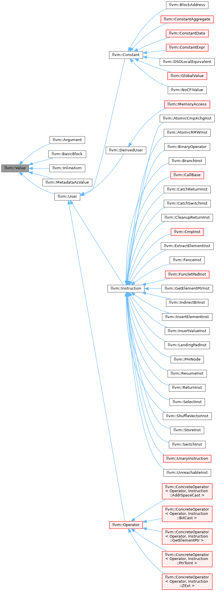

# MYC compile

参考资料：
* 南京大学编译原理实验文档  
* 学长代码：https://github.com/LittleJohnKhan/SPL-Complier  https://github.com/1171847073/C-Compiler
* 使用Flex Bison 和LLVM编写自己的编译器  http://www.cppblog.com/woaidongmao/archive/2009/11/11/100693.aspx


## 测试环境
1. Linux version 5.10.16.3-microsoft-standard-WSL2 (oe-user@oe-host) (x86_64-msft-linux-gcc (GCC) 9.3.0, GNU ld (GNU Binutils) 2.34.0.20200220)
2. flex 2.6.4
3. bison (GNU Bison) 3.5.1

## lexer和parser部分

这部分要求通过词法和语法分析，生成抽象语法树AST。

要求通过标准输出打印程序的运行结果。对于那些包含词法或者语法错误的输入文件，只要输出相关的词法或语法有误的信息即可。在这种情况下，注意不要输出任何与语法树有关的内容。要求输出的信息包括错误类型、出错的行号以及说明文字，其格式为：

```shell
Error type [错误类型] at Line [行号]: [说明文字].
```

错误类型包括：A.词法错误    B.语法错误

对于那些没有任何词法或语法错误的输入文件，你的程序需要将构造好的语法树按照先序遍历的方式打印每一个结点的信息，这些信息包括：

pass

选做内容：
1. 识别八进制和十六进制
2. 识别指数形式的浮点数
3. 识别并过滤注释
4. struct
5. sizeof
6. 类型转化

语法分析方面的考量：
* 一段程序最外面是声明，包括全局变量的声明和函数的定义
* 例如`a = 5;`这种代码只会出现在函数内，比如main函数中。所以语法分析中把这种类型作为FuncDecl的子树考虑了。

留有的一些疑问：
1. yjj中数组是怎么解析的，ARRAY关键字的作用是什么
2. PTR关键字用以表示指针，但是在EXPR中仍然有`Expr->MUL Expr`的表述，是否正确？

在yjj上做出的改进：
1. parser中删除了`Stms->CaseStm`，因为只有在switch的情况下，case才有意义，把CaseStm放到SwitchStm中了。（后续改进方向：把default在parser阶段设成唯一）
2. parser中删除了`Expr->Expr COMMA Expr`，我不明白这一步语法解析怎么提供表达式的值，感觉没有作用。
3. 将各种基本type统一用TYPE表示，int float char等关键字归到TYPE下面
4. Expr 类的类型和值要怎么定义，(Union?)




`llvm::Value`有一个`llvm::Type*`成员和一个`use list`。后者可以跟踪有哪些其他`Value`使用了自己，我们可以使用下面的迭代器对它进行访问：

- unsigned use_size() 返回有多少Value使用它
- bool use_empty() 是否没有Value使用它
- use_iterator use_begin() 返回use list的迭代器头
- use_iterator use_end() 返回尾
- User *use_back() 返回use list的最后一个元素

## llvm:Type

------

前者顾名思义表示一个类型。可以通过`Value::getType()`获取到这个`llvm::Type*`,它有一些`is*()`成员函数可以判断是下面哪种类型：

```c
 enum TypeID {    // PrimitiveTypes - make sure LastPrimitiveTyID stays up to date.
    VoidTyID = 0,    ///<  0: type with no size
    HalfTyID,        ///<  1: 16-bit floating point type
    FloatTyID,       ///<  2: 32-bit floating point type
    DoubleTyID,      ///<  3: 64-bit floating point type
    X86_FP80TyID,    ///<  4: 80-bit floating point type (X87)
    FP128TyID,       ///<  5: 128-bit floating point type (112-bit mantissa)
    PPC_FP128TyID,   ///<  6: 128-bit floating point type (two 64-bits, PowerPC)
    LabelTyID,       ///<  7: Labels
    MetadataTyID,    ///<  8: Metadata
    X86_MMXTyID,     ///<  9: MMX vectors (64 bits, X86 specific)
    TokenTyID,       ///< 10: Tokens
 
    // Derived types... see DerivedTypes.h file.
    // Make sure FirstDerivedTyID stays up to date!
    IntegerTyID,     ///< 11: Arbitrary bit width integers
    FunctionTyID,    ///< 12: Functions
    StructTyID,      ///< 13: Structures
    ArrayTyID,       ///< 14: Arrays
    PointerTyID,     ///< 15: Pointers
    VectorTyID       ///< 16: SIMD 'packed' format, or other vector type
  };
```

在LLVM中输入程序流以IR的形式呈现, 之前培训过如何打印与阅读文本形式的IR, 这次简要介绍一下在内存中IR的组织形式, 以及处理/转换IR时需要注意点.
本节主要介绍IR组织中最底层的数据结构(Value), 它们是如何组织的(有向图)以及如何修改它们之间的联系.

## 一切皆Value

当在提及Linux有一个说法是一切皆文件, 即Linux把一切设备/IO都虚拟化为文件来看待, 便于底层管理.
非常巧合的是在LLVM中也有类似的概念: 一切皆Value. Value类是LLVM中非常重要的基类, 输入程序流中的变量/常量/表达式/符号都可以被视作一个Value.
举例而言:

```rust
[03:02:36] hansy@hansy:~/source/1.llvm/llvm (master)$ clang -emit-llvm -S --target=riscv32 -O2 2.c && cat 2.ll 
; ModuleID = '2.c'
source_filename = "2.c"
target datalayout = "e-m:e-p:32:32-i64:64-n32-S128"
target triple = "riscv32"

; Function Attrs: norecurse nounwind readnone
define dso_local i32 @test(i32 %a, i32 %b) local_unnamed_addr #0 {
entry:
  %add = add nsw i32 %b, %a
  ret i32 %add
}

attributes #0 = { norecurse nounwind readnone "correctly-rounded-divide-sqrt-fp-math"="false" "disable-tail-calls"="false" "less-precise-fpmad"="false" "min-legal-vector-width"="0" "no-frame-pointer-elim"="false" "no-infs-fp-math"="false" "no-jump-tables"="false" "no-nans-fp-math"="false" "no-signed-zeros-fp-math"="false" "no-trapping-math"="false" "stack-protector-buffer-size"="8" "target-features"="+relax" "unsafe-fp-math"="false" "use-soft-float"="false" }

!llvm.module.flags = !{!0}
!llvm.ident = !{!1}

!0 = !{i32 1, !"wchar_size", i32 4}
!1 = !{!"clang version 9.0.0 (https://github.com/llvm-mirror/clang.git 8a55120a7d72bed6c93749e0a6dbd0a2fcd873dd) (https://github.com/llvm-mirror/llvm.git ff5f64e4c8e72159f06487684037dcd3eca2cd8e)"}
```

上述例子中寄存器%a, %b是Value, 运算结果%add也是Value, basic block符号entry也是Value, function符号test也是Value, !0, !1这样的metadata也是Value.
让我们先来看下Value的构成, Value类(defined in include/llvm/IR/Value.h)定义见下.

```cpp
class Value {
  Type *VTy;
  Use *UseList;
  const unsigned char SubclassID;

  // ......

  enum ValueTy {
#define HANDLE_VALUE(Name) Name##Val,
#include "llvm/IR/Value.def"

#define HANDLE_CONSTANT_MARKER(Marker, Constant) Marker = Constant##Val,
#include "llvm/IR/Value.def"
  };
};
```

Value类包含多个成员, 这里先介绍最重要的三个成员VTy, UseList以及SubclassID.

1. 一个值(Value)必然具有一个类型(Type), VTy用来记录这个Value的Type. 任何Value都具有一个类型, 哪怕它没有类型(void).
2. LLVM引入了Use类并在Value中添加一个UseList用来跟踪并记录Value的使用者. 虽然名为UseList但只是一个Use类的指针, 之后会看到LLVM是如何关联这些对象的.
3. 另外一个重要的成员是SubclassID, 这是一个const值, 用来指示这个Value的子类型. 其用于isa<>与dyn_cast<>的判断.

注意SubclassID的定义比较古怪, 对于基类类型其值定义见枚举ValueTy(该枚举由Value.def宏展开生成), 而继承类的值的定义则需见继承类中的枚举定义. 更多细节参见**[这里](https://www.cnblogs.com/Five100Miles/p/13765578.html)**.