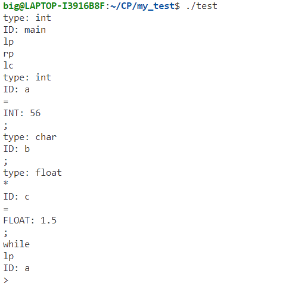

<div class="cover" style="page-break-after:always;font-family:方正公文仿宋;width:100%;height:100%;border:none;margin: 0 auto;text-align:center;">
    <div style="width:60%;margin: 0 auto;height:0;padding-bottom:10%;">
        </br></br></br></br></br></br>
        
    </div>
    </br></br></br>
    </br></br></br></br></br></br></br>
    <span style="font-family:华文黑体Bold;text-align:center;font-size:16pt;margin: 10pt auto;line-height:30pt;">本科实验报告</span>
    </br>
</br></br></br>
    <table style="border:none;text-align:center;width:72%;font-family:仿宋;font-size:14px; margin: 0 auto;">
    <tbody style="font-family:方正公文仿宋;font-size:12pt;">
    	<tr style="font-weight:normal;"> 
    		<td style="width:20%;text-align:right;">课程名称</td>
    		<td style="width:2%">：</td> 
    		<td style="width:40%;font-weight:normal;border-bottom: 1px solid;text-align:center;font-family:华文仿宋"> 编译原理</td>     </tr>
    	<tr style="font-weight:normal;"> 
    		<td style="width:20%;text-align:right;">姓　　名</td>
    		<td style="width:2%">：</td> 
    		<td style="width:40%;font-weight:normal;border-bottom: 1px solid;text-align:center;font-family:华文仿宋">郑昊伦 朱靖彦 李天烨</td>     </tr>
    	<tr style="font-weight:normal;"> 
    		<td style="width:20%;text-align:right;">学　　院</td>
    		<td style="width:2%">：</td> 
    		<td style="width:40%;font-weight:normal;border-bottom: 1px solid;text-align:center;font-family:华文仿宋">计算机科学与技术学院</td>     </tr>
    	<tr style="font-weight:normal;"> 
    		<td style="width:20%;text-align:right;">专　　业</td>
    		<td style="width:2%">：</td> 
    		<td style="width:40%;font-weight:normal;border-bottom: 1px solid;text-align:center;font-family:华文仿宋">计算机科学与技术</td>     </tr>
    	<tr style="font-weight:normal;"> 
    		<td style="width:20%;text-align:right;">学　　号</td>
    		<td style="width:2%">：</td> 
    		<td style="width:40%;font-weight:normal;border-bottom: 1px solid;text-align:center;font-family:华文仿宋">3200102570 3200104165 </td>     </tr>
      <tr style="font-weight:normal;"> 
    		<td style="width:20%;text-align:right;">指导教师</td>
    		<td style="width:2%">：</td> 
    		<td style="width:40%;font-weight:normal;text-align:center;font-family:华文仿宋">冯雁</td>     </tr>
    </tbody>              
    </table>
</br></br>
			<span style="font-family:华文黑体Bold;text-align:center;font-size:12pt;margin: 10pt auto;line-height:30pt;">2023 年 5 月 28 日</span>
</div>

# 浙江大学操作系统实验报告

项目名称：MY C Compiler

## 一、实验基本信息

### 实验要求
实现某语言的编译器；用Lex开发该语言的词法分析器，用YACC开发该语言的语法分析，并生成语法树和中间代码，最终生成目标代码（ARM或RISC-V）。语言可以是类C或者类PASCAL或者某个自定义语言，词法和语法要自己定义。

### 实验环境
* Linux 
* GCC
* Bison 
* Flex 
* llvm

### 成员分工

朱靖彦：完成了lexer，parser和ast部分

郑昊伦：

李天烨：

## 二、实验效果

本次实验我们实现了一个类C编译器，支持了以下功能：
* 函数的声明以及调用
* 变量的定义
* C语言基本语句，包括`for, if-else, while, switch-case`等等
* 基本的算术运算和逻辑运算，运算类型详见词法分析
* 数组和指针的使用
* 编译器忽略注释

## 三、词法分析

词法分析部分利用lex(flex)完成。lex是一个用于生成词法分析器的工具。它可以将输入的正则表达式转换为一个有限状态机，然后再根据这个有限状态机生成对应的词法分析器程序。

lex的基本语法如下，用`%%`来分割三个部分：

```lex
definition
%%
rules
%%
user's code
```

lex提供了一些用于辅助解析词法的变量和函数，常用的有：
*  yylineno    行号
*  yytext      当前的token
*  yyleng      当前token的长度
*  yylex       整个lexer的函数
*  yylval      用于保存token的值

在本次实验中，我们定义如下的规则来解析词法，lex将根据下面的正则表达式自动生成DFA进行解析，其中包含的运算和关键词与C语言的词法一致。部分token含有语义值，通过yylval进行传递。`definition`和`user's code`部分较为简单，基本没有内容，这里不详细展开了。

```lex
"("     { return LP; }
")"     { return RP; }
"{"     { return LC; }
"}"     { return RC; }
"["     { return LB; }
"]"     { return RB; }
"+"     { return PLUS; }
"-"     { return SUB; }
"*"     { return MULT; }
"/"     { return DIV; }
"%"     { return MOD; }
"<<"    { return SHL; }
">>"    { return SHR; }
"<"     { return LT; }
"=="    { return EQ; }
">"     { return GT; }
">="    { return GE; }
"<="    { return LE; }
"!="    { return NE; }
"="     { return EQU; }
"+="	{ return ADDEQ; }
"-="	{ return SUBEQ; }
"*="	{ return MULEQ; }
"/="	{ return DIVEQ; }
"%="	{ return MODEQ; }
"<<="   { return SHLEQ; }
">>="   { return SHREQ; }
"!"     { return NOT; }
"~"     { return BNOT; }
"&&"    { return AND; }
"&"     { return BAND; }
"||"    { return OR; }
"|"     { return BOR; }
"return"    { return RETURN; }
"if"        { return IF; }
"else"      { return ELSE; }
"do"        { return DO; }
"while"     { return WHILE; }
"for"       { return FOR; }
"break"     { return BREAK; }
"continue"  { return CONTINUE; }
"switch"	{ return SWITCH; }
"case"		{ return CASE; }
"default"	{ return DEFAULT; }
"ptr"       { return PTR; }
"array"     { return ARRAY; }
","     { return COMMA; }
";"     { return SEMI; }
":"     { return COLON; }
" " | \t | \n { ; }
"//".*  { ; }       // 这里可以忽略注释
"int"|"char"|"float"|"void" { yylval.type = new std::string(yytext, yyleng); return TYPE; }
[0-9]+                      { yylval.ival = atoi(yytext); return INT; } 
[A-Za-z_][0-9A-Za-z_]*      { yylval.sval = new std::string(yytext, yyleng); return ID; }
[0-9]+\.[0-9]+              { yylval.fval = atof(yytext); return FLOAT; }
\'.\'                       { yylval.cval = yytext[1]; return CHAR; }
.       { printf("Lex Error at Line %d: Illegal lex %s.\n", yylineno, yytext); }
```

其中有关变量类型的定义，我们用含有语义值的token(TYPE)表示一个变量类型的token，并将其语义值以string的形式传递到parser阶段具体分析其类型。

## 四、语法分析及抽象语法树的构建

这部分的作用是，检验程序的语法结构，并且生成抽象语法树提交到下一环节。本环节我们使用了Yacc(Bison)来解析语法。Yacc是一种语法生成器，它将带注释的CFG转换为LALR（1）表，对输入的token进行语法解析。Bison是Yacc的GNU版本。

Yacc的语法结构和lex类似，同样是三段式，用`%%`分割

```yacc
definition
%%
rules
%%
user's code
```

在Yacc的定义部分，我们需要导入使用的库文件，并且举出需要用到的终结符和非终结符，以及一些优先级的说明。`%token xx`标记该类型为token，`%left`和`%right`用于解决规约-规约冲突，同时表示左结合/右结合性质，后定义的优先级更高。`%type<xx> xxx`则用于定义非终结符。

由于C语言程序代码最外层都是定义和声明，所以我们设计的语法规则从Root出发，首先将代码分为一组组函数/变量定义和声明，然后再在具体的函数内部解析各个语句。基本的规则如下（由于Expression和Statement中的规约重复度高，而且比较简单，所以这里略去了一部分，只展示了CFG最基本的结构）。

```yacc
Root:       Decls       { $$ = new node::Root(*$1); }
            ;

Decls:      Decls Decl  { $1->push_back($2);    $$ = $1; }
            |           { $$ = new node::Decls(); }
            ;

Decl:       VarDecl     { $$ = $1; }
            | FuncDecl  { $$ = $1; }
            ;

VarDecl:    VarType VarList SEMI    { $$ = new node::VarDecl($1, $2); }
            ;

VarList:    VarList COMMA VarInit   { $$ = $1; $$->push_back($3); }
           | VarInit                { $$ = new node::VarList(); $$->push_back($1); }
           ;
     
VarInit:    ID              { $$ = new node::VarInit(*$1); }
            | ID EQU Expr   { $$ = new node::VarInit(*$1, $3); }
            ;

VarType:    TYPE                    { $$ = new node::VarType(type2int(*$1)); }
            | TYPE PTR              { $$ = new node::PtrType(type2int(*$1)); }
            | TYPE ARRAY LB INT RB  { $$ = new node::ArrayType(type2int(*$1), $4); }
            ;

FuncDecl:   VarType ID LP Args RP SEMI          { $$ = new node::FuncDecl($1, *$2, $4); }
            | VarType ID LP Args RP FuncBody    { $$ = new node::FuncDecl($1, *$2, $4, $6); }
            ;

FuncBody:	LC Stms RC              { $$ = $2;} 
            ;

Args:       Args COMMA Arg  { $$ = $1; $$->push_back($3); }
            |               { $$ = new node::Args(); }
            ;

Arg:        VarType ID      { $$ = new node::Args($1, *$2); }
            | VarType       { $$ = new node::Args($1); }
            ;  

Stms:       Stms Stm        { $$ = $1; $$->push_back($2); }
            |               { $$ = new node::Stms(); }
            ;
            
Stm:        ...;           

Expr:       ...;

```

在每一条规约的`{}`包含着用到该规约时产生的额外效果，这里我们需要通过这些额外效果构建抽象语法树。下面将介绍抽象语法树的数据结构，定义在`node.hpp`中。

```c++
class Node;
    class Root;
            
    class VarType;
        class PtrType;
        class ArrayType;

    class Stm;
        class Decl;
            class FuncDecl;
                class Arg;
            class VarDecl;
                class VarInit;
		class IfStm;
		class ForStm;
		class WhileStm;
		class DoStm;
		class SwitchStm;
			class CaseStm;
		class BreakStm;
		class ContinueStm;
		class ReturnStm;
		class Block;
        class ExprStm;

    class Expr;
        class SOP;
        class BINOP;
        class ID;
        class Constant;
            class Int;
            class Float;
            class Char;
        class FuncCall;
        class ArrayCall;

typedef std::vector<Stm*> Stms;
typedef std::vector<Decl*> Decls;
typedef std::vector<Expr*> ExprList;
typedef std::vector<CaseStm*> Cases;
typedef std::vector<VarInit*> VarList;
typedef std::vector<Arg*> Args;
```

上面代码定义的类构成了语法树的基本单元，其中的缩进表示类的继承关系（除了`Arg`和`VarInit`，这两个类是上一级类的子组分）。

在yacc解析语法进行规约时，每用到一次规约，都会调用`node.hpp`中对应的构造函数，构造一个继承于`node`的对象。该对象可能会有一些子节点，在调用构造函数时一同传入。由于LR文法是一种自底向上的文法，所以子节点总是能先构造完成。最后得到Root结点就可以完成整棵抽象语法树。

## 五、语义分析

## 六、代码生成和代码优化

## 七、测试

### lex部分的测试

我们在每个token后面增加一行代码(比如`"(" { cout << "lp " << endl;}`)，使其打印出对应的token内容，输入文件`test.txt`并打印出结果。
`test.txt`为如下代码
```c++
// abc
int main()
{
    int a = 56;
    char b;
    float *c = 1.5;
    while(a > 0) {
        a = a - 1;
    }
    if(a == 0) b = 'a';
    return 0;
}
```

打印出的结果如下：
```shell
~/CP/MY_C_compiler$ ./lex_test

type: int
ID: main
lp 
rp 

lc 

type: int
ID: a
=  
INT: 56
;  

type: char
ID: b
;  

type: float
*  
ID: c
=  
FLOAT: 1.5
;  

while 
lp 
ID: a
>  
INT: 0
rp 
lc 

ID: a
=  
ID: a
-  
INT: 1
;  

rc 

if 
lp 
ID: a
== 
INT: 0
rp 
ID: b
=  
CHAR: a
;  

return 
INT: 0
;  

rc 
```
对应的截图：



可以看到，每个lex的值均打印成功，尤其是ID,FLOAT,INT,CHAR这些比较复杂的正则表达式均能实现成功。


```shell
root@4f6fd4e892c2:/home/tmp/MY_C_compiler# echo 'void main(){ int a = 1; int x = 3*a + 5;}' | ./parser
[main starts]

[parser root]: 0x693be0
[paerser done]
Generating code...
[INFO]: Into CodeGen
[INFO]: into for
[INFO]: Generating the 
Generating stm 
Generating integer: 1
Generating stm 
Creating binary operation plus 
Creating binary operation mult 
Generating integer: 3
Generating identifier reference: a
Generating integer: 5
Genetated function body
Generated function: main
[INFO]: Generated ROOT
Code is generated.

; ModuleID = 'main'
source_filename = "main"

define internal void @main() {
entry:
}

define internal void @main.1() {
entry:
  %a = alloca i64
  store i64 1, i64* %a
  %x = alloca i64
  %0 = load i64*, i64* %a
  %1 = mul i64 3, i64* %0
  %2 = add i64 %1, 5
  store i64 %2, i64* %x
  ret void
}