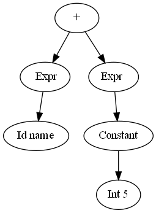

<div class="cover" style="page-break-after:always;font-family:方正公文仿宋;width:100%;height:100%;border:none;margin: 0 auto;text-align:center;">
    <div style="width:60%;margin: 0 auto;height:0;padding-bottom:10%;">
        </br></br></br></br></br></br>
        
    </div>
    </br></br></br>
    </br></br></br></br></br></br></br>
    <span style="font-family:华文黑体Bold;text-align:center;font-size:16pt;margin: 10pt auto;line-height:30pt;">本科实验报告</span>
    </br>
</br></br></br>
    <table style="border:none;text-align:center;width:72%;font-family:仿宋;font-size:14px; margin: 0 auto;">
    <tbody style="font-family:方正公文仿宋;font-size:12pt;">
        <tr style="font-weight:normal;"> 
            <td style="width:20%;text-align:right;">课程名称</td>
            <td style="width:2%">：</td> 
            <td style="width:40%;font-weight:normal;border-bottom: 1px solid;text-align:center;font-family:华文仿宋"> 编译原理</td>     </tr>
        <tr style="font-weight:normal;"> 
            <td style="width:20%;text-align:right;">姓　　名</td>
            <td style="width:2%">：</td> 
            <td style="width:40%;font-weight:normal;border-bottom: 1px solid;text-align:center;font-family:华文仿宋">郑昊伦 朱靖彦 李天烨</td>     </tr>
        <tr style="font-weight:normal;"> 
            <td style="width:20%;text-align:right;">学　　院</td>
            <td style="width:2%">：</td> 
            <td style="width:40%;font-weight:normal;border-bottom: 1px solid;text-align:center;font-family:华文仿宋">计算机科学与技术学院</td>     </tr>
        <tr style="font-weight:normal;"> 
            <td style="width:20%;text-align:right;">专　　业</td>
            <td style="width:2%">：</td> 
            <td style="width:40%;font-weight:normal;border-bottom: 1px solid;text-align:center;font-family:华文仿宋">计算机科学与技术</td>     </tr>
        <tr style="font-weight:normal;"> 
            <td style="width:20%;text-align:right;">学　　号</td>
            <td style="width:2%">：</td> 
            <td style="width:40%;font-weight:normal;border-bottom: 1px solid;text-align:center;font-family:华文仿宋">3200102570 3200104165 </td>     </tr>
      <tr style="font-weight:normal;"> 
            <td style="width:20%;text-align:right;">指导教师</td>
            <td style="width:2%">：</td> 
            <td style="width:40%;font-weight:normal;text-align:center;font-family:华文仿宋">冯雁</td>     </tr>
    </tbody>              
    </table>
</br></br>
            <span style="font-family:华文黑体Bold;text-align:center;font-size:12pt;margin: 10pt auto;line-height:30pt;">2023 年 5 月 28 日</span>
</div>


# 浙江大学操作系统实验报告

项目名称：MY C Compiler

## 一、实验基本信息

### 实验要求

实现某语言的编译器；用Lex开发该语言的词法分析器，用YACC开发该语言的语法分析，并生成语法树和中间代码，最终生成目标代码（ARM或RISC-V）。语言可以是类C或者类PASCAL或者某个自定义语言，词法和语法要自己定义。

### 实验环境

* Linux 
* GCC
* Bison 
* Flex 
* llvm

### 成员分工

朱靖彦：完成了lexer，parser和ast部分

郑昊伦：完成了语义分析、构建抽象语法树、代码生成和代码优化部分

李天烨：

## 二、实验效果

本次实验我们实现了一个类C编译器，支持了以下功能：

* 函数的声明以及调用
* 变量的定义
* C语言基本语句，包括`for, if-else, while, switch-case`等等
* 基本的算术运算和逻辑运算，运算类型详见词法分析
* 数组和指针的使用
* 编译器忽略注释

## 三、词法分析

词法分析部分利用lex(flex)完成。lex是一个用于生成词法分析器的工具。它可以将输入的正则表达式转换为一个有限状态机，然后再根据这个有限状态机生成对应的词法分析器程序。

lex的基本语法如下，用`%%`来分割三个部分：

```lex
definition
%%
rules
%%
user's code
```

lex提供了一些用于辅助解析词法的变量和函数，常用的有：

*  yylineno    行号
*  yytext      当前的token
*  yyleng      当前token的长度
*  yylex       整个lexer的函数
*  yylval      用于保存token的值

在本次实验中，我们定义如下的规则来解析词法，lex将根据下面的正则表达式自动生成DFA进行解析，其中包含的运算和关键词与C语言的词法一致。部分token含有语义值，通过yylval进行传递。`definition`和`user's code`部分较为简单，基本没有内容，这里不详细展开了。

```lex
"("     { return LP; }
")"     { return RP; }
"{"     { return LC; }
"}"     { return RC; }
"["     { return LB; }
"]"     { return RB; }
"+"     { return PLUS; }
"-"     { return SUB; }
"*"     { return MULT; }
"/"     { return DIV; }
"%"     { return MOD; }
"<<"    { return SHL; }
">>"    { return SHR; }
"<"     { return LT; }
"=="    { return EQ; }
">"     { return GT; }
">="    { return GE; }
"<="    { return LE; }
"!="    { return NE; }
"="     { return EQU; }
"+="	{ return ADDEQ; }
"-="	{ return SUBEQ; }
"*="	{ return MULEQ; }
"/="	{ return DIVEQ; }
"%="	{ return MODEQ; }
"<<="   { return SHLEQ; }
">>="   { return SHREQ; }
"!"     { return NOT; }
"~"     { return BNOT; }
"&&"    { return AND; }
"&"     { return BAND; }
"||"    { return OR; }
"|"     { return BOR; }
"return"    { return RETURN; }
"if"        { return IF; }
"else"      { return ELSE; }
"do"        { return DO; }
"while"     { return WHILE; }
"for"       { return FOR; }
"break"     { return BREAK; }
"continue"  { return CONTINUE; }
"switch"	{ return SWITCH; }
"case"		{ return CASE; }
"default"	{ return DEFAULT; }
"ptr"       { return PTR; }
"array"     { return ARRAY; }
","     { return COMMA; }
";"     { return SEMI; }
":"     { return COLON; }
" " | \t   { ; }
"\n"      { ; }
"//".*  { ; }
"int"|"char"|"float"|"void" { yylval.type = new std::string(yytext, yyleng); return TYPE; }
[0-9]+                      { yylval.ival = atoi(yytext); return INT; } 
[A-Za-z_][0-9A-Za-z_]*      { yylval.sval = new std::string(yytext, yyleng); return ID; }
[0-9]+\.[0-9]+              { yylval.fval = atof(yytext); return FLOAT; }
"\'"."\'"                   { yylval.cval = yytext[1]; return CHAR; }
.       { printf("Lex Error at Line %d: Illegal lex %s.\n", yylineno, yytext); }

```

其中有关变量类型的定义，我们用含有语义值的token(TYPE)表示一个变量类型的token，并将其语义值以string的形式传递到parser阶段具体分析其类型。

## 四、语法分析及抽象语法树的构建

这部分的作用是，检验程序的语法结构，并且生成抽象语法树提交到下一环节。本环节我们使用了Yacc(Bison)来解析语法。Yacc是一种语法生成器，它将带注释的CFG转换为LALR（1）表，对输入的token进行语法解析。Bison是Yacc的GNU版本。

Yacc的语法结构和lex类似，同样是三段式，用`%%`分割

```yacc
definition
%%
rules
%%
user's code
```

在Yacc的定义部分，我们需要导入使用的库文件，并且举出需要用到的终结符和非终结符，以及一些优先级的说明。`%token xx`标记该类型为token，`%left`和`%right`用于解决规约-规约冲突，同时表示左结合/右结合性质，后定义的优先级更高。`%type<xx> xxx`则用于定义非终结符并声明其数据结构。

由于C语言程序代码最外层都是定义和声明，所以我们设计的语法规则从Root出发，首先将代码分为一组组函数/变量定义和声明，然后再在具体的函数内部解析各个语句。基本的规则如下（由于Expression和Statement中的规约重复度高，而且比较简单，所以这里略去了一部分，只展示了CFG最基本的结构）。

```yacc
Root:       Decls { $$ = new node::Root($1, yylineno); root = $$; std::cout << "[parser root]: " << $$ << std::endl;printf("The yylino:%d\n",yylineno); }
            ;

Decls:      Decls Decl  { $1->push_back($2);    $$ = $1; }
            |           { $$ = new node::Decls(); }
            ;

Decl:       VarDecl     { $$ = $1; }
            | FuncDecl  { $$ = $1; }
            ;

VarDecl:    VarType VarList SEMI    { $$ = new  node::VarDecl($1, $2, yylineno); }
            ;

VarList:    VarList COMMA VarInit   { $$ = $1; $$->push_back($3); }
           | VarInit                { $$ = new  node::VarList(); $$->push_back($1); }
           ;
     
VarInit:    ID              { $$ = new  node::VarInit(*$1, yylineno); }
            | ID EQU Expr   { $$ = new  node::VarInit(*$1, $3, yylineno); }
            | ID EQU LC ExprList RC { $$ = new node::VarInit(*$1, $4, yylineno); }
            ;

VarType:    TYPE                    { $$ = new  node::VarType(type2int(*$1), yylineno, false, false); }
            | TYPE PTR              { $$ = new  node::PtrType(type2int(*$1), yylineno); }
            | TYPE ARRAY LB INT RB  { $$ = new  node::ArrayType(type2int(*$1), $4, yylineno); }
            ;

FuncDecl:   VarType ID LP Args RP SEMI          { $$ = new  node::FuncDecl($1, *$2, $4, yylineno); }
            | VarType ID LP Args RP FuncBody    { $$ = new  node::FuncDecl($1, *$2, $4, yylineno, $6); }
            ;

FuncBody:	LC Stms RC              { $$ = $2;} 
            ;

Args:       _Args COMMA Arg  { $$ = $1; $$->push_back($3); }
            |Arg            { $$ = new  node::Args();$$->push_back($1); }
            |               { $$ = new  node::Args(); }
            ;

Arg:        VarType ID      { $$ = new node::Args($1, *$2); }
            | VarType       { $$ = new node::Args($1); }
            ;  

Stms:       Stms Stm        { $$ = $1; $$->push_back($2); }
            |               { $$ = new node::Stms(); }
            ;
            
Stm:        ...;           

Expr:       ...;

```

在每一条规约的`{}`包含着用到该规约时产生的额外效果，这里我们需要通过这些额外效果构建抽象语法树。下面将介绍抽象语法树的数据结构，定义在`node.hpp`中。

```c++
class Node;
    class Root;
            
    class VarType;
        class PtrType;
        class ArrayType;

    class Stm;
        class Decl;
            class FuncDecl;
                class Arg;
            class VarDecl;
                class VarInit;
        class IfStm;
        class ForStm;
        class WhileStm;
        class DoStm;
        class SwitchStm;
            class CaseStm;
        class BreakStm;
        class ContinueStm;
        class ReturnStm;
        class Block;
        class ExprStm;

    class Expr;
        class SOP;
        class BINOP;
        class ID;
        class Constant;
            class Int;
            class Float;
            class Char;
        class FuncCall;
        class ArrayCall;

typedef std::vector<Stm*> Stms;
typedef std::vector<Decl*> Decls;
typedef std::vector<Expr*> ExprList;
typedef std::vector<CaseStm*> Cases;
typedef std::vector<VarInit*> VarList;
typedef std::vector<Arg*> Args;
```

上面代码定义的类构成了语法树的基本单元，其中的缩进表示类的继承关系（除了`Arg`和`VarInit`，这两个类是上一级类的子组分）。

在yacc解析语法进行规约时，每用到一次规约，都会调用`node.hpp`中对应的构造函数，构造一个继承于`node`的对象。该对象可能会有一些子节点，在调用构造函数时一同传入。由于LR文法是一种自底向上的文法，所以子节点总是能先构造完成。最后得到Root结点就可以完成整棵抽象语法树。

## 五、语义分析

在这一部分，使用了`C++`中的类继承的概念，以便于后续更好地构造语法树，最终的目标，是生成以`Root`类为根的语法树。
类与类之间的继承关系，已经在上一部分中描述得比较详细，首先看最底层的基类`Node`:
```c++
    class Node {
    public:
        int line;
        Node() {}
        virtual ~Node() {}
        virtual llvm::Value* CodeGen(CodeContext& context) {};
    };
```
其中的`CodeGen`是用于解析该语法树，生成最后的机器码，在下一部分会进行详细描述。
每一个`Node`相当于树中的一个节点，根据其具体含义，选择不同的子类进行初始化，赋予其对应的值。
以`BINOP`类为例，来跟踪其解析和构造过程：
首先在`parser.y`中，根据`Expr`的出现的二元运算的不同规约(也即运算中使用的不同运算符号)，来构造不同类型的二元运算，以加法为例：
```c++
Expr: Expr PLUS Expr { $$ = new node::BINOP($1, node::plus_, $3, yylineno); }
```
再看`node.hpp`中，`BINOP`类的初始化过程：
```c++
BINOP(Expr* lhs, int op, Expr* rhs, int line) :
    lhs(lhs), rhs(rhs), op(op), Expr(line) { }
```
其中的`lhs和rhs`作为该二元运算的两个运算数，构成了该节点的两个子节点，并且在`parser`的过程中，在之前的规约就已经生成，所以直接赋值即可，并且解析了其中的运算符`op`，在后续的代码生成中，根据不同的运算符，生成不同的机器码。
假如其中的一个子节点是一个`Id`，另一个则是一个整型常量5，则将`lexer`中得到的名称，作为初始化值，来初始化该`id`:
```c++
Expr: ID { $$ = new  node::Id(*$1, yylineno); }
Id(const std::string& __name, int line) : _name(__name), Expr(line) { }

Expr: Constant { $$ = $1; }
Constant: INT  { $$ = new node::Int($1, yylineno); }
Constant(int __type, int line) : _type(__type), Expr(line) { }
Int(long long __value, int line, int __type = 3) : Constant(__type, line), _value(__value) { }
```


上述过程就是程序中，一个简单的语义分析，并构建树节点之间的关系的流程，而整个语法树的构建，则是放大该过程，将所有输入按照规约关系，自底向上生成最后的`Root`节点

## 六、代码生成和代码优化
在`CodeTran.hpp`和`CodeTran.cpp`中，声明并定义了，对某个特定类的节点，该用什么样的方式解析并生成`llvm`机器码，最后输出完整的机器码。
首先需要定义好将要使用的两个，要生成机器码的维护基本信息的类：
```c++
class CodeBlock{
public:
    BasicBlock *codeblock;
    CodeBlock *prev;
    CodeBlock *next;
    std::map<std::string, Value*> local_vars;
    CodeBlock() ;
};
```
该类相当于对于`llvm`中的`BasicBlock`类的封装，每一个`BasicBlock`都包含了基本的代码块，额外添加了两个指针`prev`和`next`，用来将其构建成一个双向链表，以便于后续代码的生成和优化
`local_vars`相当于本地的符号表，用来存储不同的`identifier`，便于后续的解析和生成存取指令的生成
```c++
class CodeContext{
private:
    CodeBlock* head_block;
    CodeBlock* tail_block;
    Function* mainfunction;

public:
    std::map<std::string, Value*> global_vars;
    std::map<std::string, CodeBlock*> func_table;
    std::map<std::string, Value*>& cur_vars;
    Module *module;
    IRBuilder<> builder;
    int opnums;
    int fors;
    int blocks;
    CodeContext();
    void CreateContext(node::Root* root);
    GenericValue runCode();
    CodeBlock* HeadBlock();
    CodeBlock* TailBlock();
    void InsBlock(CodeBlock* new_block);
    void RmHeadBlock();
      
};
```
该类相当于最后解析出的机器码文件的元信息，包含了`CodeBlock`组成的双向链表，已经对其进行操作和维护的一系列函数，其中一些变量的含义为：
- `head_block,tail_block`:头尾`CodeBlock`
- `mainFunction`:`main`函数指针
- `module`：`llvm`提供的模板
- `builder`:`llvm`提供的指令构建器
- `opnum`:出现的操作符数，便于对其初始化
- `fors`:`for`模块的数量，便于初始化
- `blocks`:构建的代码块`block`的数量，同样便于初始化

在这里，就需要用到在每个`Node`中定义的代码生成函数：`CodeGen`，对于每个节点，通过遍历子节点的方式，在`CodeBlock`中生成代码，在`llvm`中，最基本的概念就是`Value*`指针，对于一些操作，以及参与操作的数字，都是使用该指针来描述

同样的，以某一个`BINOP`节点为例，查看代码的生成过程：
```c++
Value* BINOP::CodeGen(CodeContext& context){
    std::cout << "Creating binary operation " << bops[op] << endl;
    auto vars = context.localvars();
    switch (op)
    {
        case 1 :case 15:return context.builder.CreateAdd( lhs->CodeGen(context),rhs->CodeGen(context),(string("add_") + to_string(context.opnums++)).c_str());
        case 2 :...
        case 9 :return context.builder.CreateICmpULE(INTCAST(lhs->CodeGen(context)),INTCAST(rhs->CodeGen(context)),(string("le_") + to_string(context.opnums++)).c_str());
        case 10:...
}
```
`builder.CreateAdd`就是创建一个加法指令，并赋予标号`add_opnums`，它的两个运算数，分别为他的两个子节点：`lhs`和`rhs`，再分别调用其内的`CodeGen`，生成参与运算的`Value*`指针，同样的，如果左边是一个`Id`类型，名为`i`，右边是一个`constInt`类型，该表达式就相当于：
- 取出变量`i`中的值
- 用刚刚取出的值与5相加
先看`Id`中的`CodeGen`:
```c++
Value* Id::CodeGen(CodeContext& context){
    std::cout << "Generating identifier reference: " << _name << endl;
    std::map<std::string , Value*>& vars = context.localvars();

    if (vars.find(_name) == vars.end()) {
        std::cerr << "undeclared variable " << _name << endl;
        return NULL;
    }
    ....
    LoadInst* load = context.builder.CreateLoad(vars[_name]);
    auto res = load->getPointerOperand ();

    return res;
}

```
基本思路是，得到`context`中的本地符号表，寻找对应的变量`i`存放的地址，使用`load`来得到该值，备用
再看`Int`类型的`CodeGen`部分：
```c++
Value* Int::CodeGen(CodeContext& context){
    std::cout << "Generating integer: " << _value << endl;
    Value* res = context.builder.getInt64(_value);
    return res;

}
```
生成并返回一个`Int64`类型的整数
左右子节点分别返回了用于`Add`操作的操作数，即可生成`add`指令
最后生成的结果如下所示：
```assembly
  %0 = load i64, i64* %i
  %add_0 = add i64* %i, i64 1
```
由于所有的类型数量较多，所有的实现也都大同小异，上述实例又比较有代表性，就不在此多加赘述
而对于代码优化的部分，则是需要在双向链表的基础上，考虑代码的执行流，再做出对应的优化，在这里还尚未有很好的实现
## 七、测试

### lex部分的测试

我们在每个token后面增加一行代码(比如`"(" { cout << "lp " << endl;}`)，使其打印出对应的token内容，输入文件`test.txt`并打印出结果。
`test.txt`为如下代码

```c++
// abc
int main()
{
    int a = 56;
    char b;
    float *c = 1.5;
    while(a > 0) {
        a = a - 1;
    }
    if(a == 0) b = 'a';
    return 0;
}
```

打印出的结果如下：

```shell
~/CP/MY_C_compiler$ ./lex_test
type: int
ID: main
lp 
rp 
lc 
type: int
ID: a
=  
INT: 56
;  
type: char
ID: b
;  
type: float
*  
ID: c
=  
FLOAT: 1.5
;  
while 
lp 
ID: a
>  
INT: 0
rp 
lc 
ID: a
=  
ID: a
-  
INT: 1
;  
rc 
if 
lp 
ID: a
== 
INT: 0
rp 
ID: b
=  
CHAR: a
;  
return 
INT: 0
;  
rc 
```

对应的截图：


可以看到，每个lex的值均打印成功，尤其是ID,FLOAT,INT,CHAR这些比较复杂的正则表达式均能实现成功。

### 代码生成测试

在这里，使用了一个，简单的生成斐波那契数列的程序进行测试，并定义了一个简单的函数：


```shell
void temp(){
    int a,b,c;
    c = a*b;
}
int main(){
    int i ;
    int a = 1,b = 1,tmp;

    // tmp = a + b;
    for (i = 0; i < 10;i=i+1){
        a = a + b;
        tmp = a;
        a = b;
        b = tmp;
    }
    
    // return 0;
}
```

以下是其生成的机器码结果：

```assembly
; ModuleID = 'main'
source_filename = "main"

define internal void @main() {
entry:
}

define internal void @temp() {
entry:
  %a = alloca i64
  %b = alloca i64
  %c = alloca i64
  store i64* %mul_0, i64* %c
  ret void
}

define internal i64 @main.1() {
entry:
  %i = alloca i64
  %a = alloca i64
  store i64 1, i64* %a
  %b = alloca i64
  store i64 1, i64* %b
  %tmp = alloca i64
  store i64 0, i64* %i
  br label %step
  store i64* %add_2, i64* %i
  ret void

block:                                            ; preds = %step
  store i64* %add_1, i64* %a
  store i64* %a, i64* %tmp
  store i64* %b, i64* %a
  store i64* %tmp, i64* %b
  %0 = load i64, i64* %i
  %add_2 = add i64* %i, i64 1
  br label %step

step:                                             ; preds = %block, %entry
  %1 = load i64, i64* %i
  %2 = sext i64* %i to i32
  %lt = icmp ult i32 %2, 10
  br i1 %lt, label %block, label %exit

exit:                                             ; preds = %step
}
```

